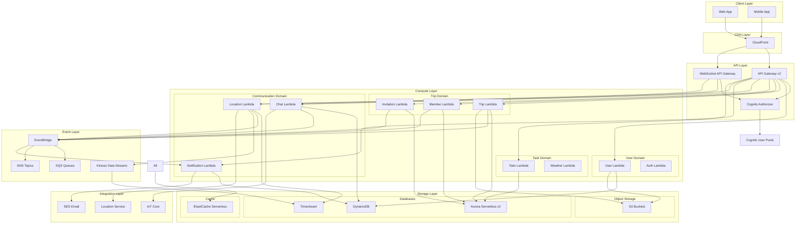

# AWS Serverless Architecture Design for NomadCrew

## Architecture Overview

This document presents a detailed AWS-native serverless architecture design for the NomadCrew backend, transforming the current monolithic Go application into a scalable, event-driven microservices architecture.

---

## High-Level Architecture



---

## Service Architecture Details

### 1. **API Gateway Configuration**

#### REST API (HTTP APIs)
```yaml
# serverless.yml excerpt
provider:
  httpApi:
    cors:
      allowedOrigins:
        - https://nomadcrew.uk
        - https://app.nomadcrew.uk
      allowedHeaders:
        - Content-Type
        - Authorization
        - X-Request-ID
      allowedMethods:
        - GET
        - POST
        - PUT
        - DELETE
        - PATCH
    authorizers:
      cognitoAuthorizer:
        type: jwt
        identitySource: $request.header.Authorization
        issuerUrl: https://cognito-idp.us-east-1.amazonaws.com/{userPoolId}
        audience:
          - {userPoolClientId}
```

#### WebSocket API
```yaml
websocketApi:
  name: nomadcrew-websocket-api
  routeSelectionExpression: $request.body.action
  routes:
    $connect:
      authorizer: cognitoAuthorizer
    $disconnect:
      lambda: disconnectHandler
    sendMessage:
      lambda: chatMessageHandler
    updateLocation:
      lambda: locationUpdateHandler
```

### 2. **Lambda Function Architecture**

#### Base Lambda Configuration
```typescript
// lambda-base-config.ts
export const baseLambdaConfig = {
  runtime: 'provided.al2023', // Go custom runtime
  architecture: 'arm64', // Graviton2 for cost savings
  memorySize: 512,
  timeout: 29, // API Gateway limit
  environment: {
    POWERTOOLS_SERVICE_NAME: 'nomadcrew',
    POWERTOOLS_METRICS_NAMESPACE: 'NomadCrew',
    LOG_LEVEL: 'INFO'
  },
  tracing: 'Active',
  layers: [
    'arn:aws:lambda:region:account:layer:aws-lambda-powertools-go:1'
  ]
};
```

#### Function Organization
```
/functions
  /user
    - create-user/
    - get-user/
    - update-user/
    - sync-user/
  /trip
    - create-trip/
    - update-trip/
    - list-trips/
    - delete-trip/
  /chat
    - send-message/
    - get-messages/
    - websocket-handler/
  /location
    - update-location/
    - get-locations/
    - stream-processor/
```

### 3. **Data Storage Strategy**

#### Aurora Serverless v2 (PostgreSQL)
**Use for**: Transactional data requiring ACID properties
```sql
-- Core tables remain similar to current design
-- Add read replicas for scaling read operations
-- Use RDS Proxy for connection management

-- Example: Optimized trips table
CREATE TABLE trips (
    id UUID PRIMARY KEY DEFAULT gen_random_uuid(),
    name VARCHAR(255) NOT NULL,
    -- ... other fields
    created_at TIMESTAMPTZ DEFAULT NOW(),
    updated_at TIMESTAMPTZ DEFAULT NOW(),
    -- Partition by status for query optimization
    status trip_status NOT NULL
) PARTITION BY LIST (status);

CREATE TABLE trips_active PARTITION OF trips FOR VALUES IN ('ACTIVE');
CREATE TABLE trips_planning PARTITION OF trips FOR VALUES IN ('PLANNING');
CREATE TABLE trips_completed PARTITION OF trips FOR VALUES IN ('COMPLETED');
```

#### DynamoDB Tables
**Use for**: High-velocity data, user sessions, chat messages

```javascript
// User Sessions Table
{
  TableName: 'UserSessions',
  PartitionKey: 'userId',
  SortKey: 'sessionId',
  TTL: 'expiresAt',
  GlobalSecondaryIndexes: [{
    IndexName: 'SessionByToken',
    PartitionKey: 'sessionToken'
  }]
}

// Chat Messages Table
{
  TableName: 'ChatMessages',
  PartitionKey: 'tripId',
  SortKey: 'timestamp#messageId',
  GlobalSecondaryIndexes: [{
    IndexName: 'MessagesByUser',
    PartitionKey: 'userId',
    SortKey: 'timestamp'
  }]
}

// User Profiles Cache
{
  TableName: 'UserProfiles',
  PartitionKey: 'userId',
  TTL: 'ttl', // 1 hour cache
  StreamSpecification: {
    StreamViewType: 'NEW_AND_OLD_IMAGES'
  }
}
```

#### Timestream for Location Data
```javascript
// Location tracking time-series data
{
  DatabaseName: 'nomadcrew',
  TableName: 'user_locations',
  RetentionProperties: {
    MemoryStoreRetentionPeriodInHours: 24,
    MagneticStoreRetentionPeriodInDays: 30
  },
  Schema: {
    Dimensions: [
      { Name: 'userId', Type: 'VARCHAR' },
      { Name: 'tripId', Type: 'VARCHAR' }
    ],
    Measures: [
      { Name: 'latitude', Type: 'DOUBLE' },
      { Name: 'longitude', Type: 'DOUBLE' },
      { Name: 'accuracy', Type: 'DOUBLE' }
    ]
  }
}
```

### 4. **Event-Driven Architecture**

#### EventBridge Event Bus
```javascript
// Custom event bus for application events
const eventBus = new EventBus(stack, 'NomadCrewEventBus', {
  eventBusName: 'nomadcrew-events'
});

// Event patterns
const tripEventPattern = {
  source: ['nomadcrew.trips'],
  detailType: [
    'Trip Created',
    'Trip Updated',
    'Trip Deleted',
    'Member Added',
    'Member Removed'
  ]
};

// Event routing rules
new Rule(stack, 'TripNotificationRule', {
  eventBus,
  eventPattern: tripEventPattern,
  targets: [
    new LambdaFunction(notificationLambda),
    new SqsQueue(auditQueue)
  ]
});
```

#### SQS Message Queues
```javascript
// Notification queue with DLQ
const notificationQueue = new Queue(stack, 'NotificationQueue', {
  visibilityTimeout: Duration.seconds(300),
  deadLetterQueue: {
    queue: new Queue(stack, 'NotificationDLQ'),
    maxReceiveCount: 3
  }
});

// Email processing queue
const emailQueue = new Queue(stack, 'EmailQueue', {
  fifo: true,
  contentBasedDeduplication: true
});
```

### 5. **Real-time Communication**

#### WebSocket Connection Management
```go
// connection-handler.go
func handleConnect(ctx context.Context, request events.APIGatewayWebsocketProxyRequest) error {
    userId := request.RequestContext.Authorizer["claims"].(map[string]interface{})["sub"].(string)
    connectionId := request.RequestContext.ConnectionID
    
    // Store connection in DynamoDB
    item := ConnectionItem{
        ConnectionId: connectionId,
        UserId:      userId,
        ConnectedAt: time.Now().Unix(),
        TTL:         time.Now().Add(24 * time.Hour).Unix(),
    }
    
    return dynamoClient.PutItem(ctx, "WebSocketConnections", item)
}
```

#### IoT Core for Scalable Pub/Sub
```javascript
// IoT Thing per user for real-time updates
const userThing = new CfnThing(stack, `UserThing-${userId}`, {
  thingName: `user-${userId}`,
  attributePayload: {
    attributes: {
      userId: userId,
      deviceType: 'virtual'
    }
  }
});

// Topic structure
// trips/{tripId}/chat - Chat messages
// users/{userId}/location - Location updates
// trips/{tripId}/updates - Trip updates
```

### 6. **Security Architecture**

#### Cognito User Pools
```javascript
const userPool = new UserPool(stack, 'NomadCrewUserPool', {
  userPoolName: 'nomadcrew-users',
  selfSignUpEnabled: true,
  signInAliases: {
    email: true,
    username: true
  },
  autoVerify: { email: true },
  standardAttributes: {
    email: { required: true },
    givenName: { required: true },
    familyName: { required: true }
  },
  customAttributes: {
    'profilePicture': new StringAttribute(),
    'preferences': new StringAttribute()
  },
  passwordPolicy: {
    minLength: 8,
    requireLowercase: true,
    requireUppercase: true,
    requireDigits: true,
    requireSymbols: true
  },
  mfa: cognito.Mfa.OPTIONAL,
  mfaSecondFactor: {
    sms: true,
    otp: true
  }
});
```

#### IAM Roles and Policies
```javascript
// Lambda execution role with least privilege
const lambdaRole = new Role(stack, 'LambdaExecutionRole', {
  assumedBy: new ServicePrincipal('lambda.amazonaws.com'),
  managedPolicies: [
    ManagedPolicy.fromAwsManagedPolicyName('service-role/AWSLambdaBasicExecutionRole'),
    ManagedPolicy.fromAwsManagedPolicyName('AWSXRayDaemonWriteAccess')
  ],
  inlinePolicies: {
    'DynamoDBAccess': new PolicyDocument({
      statements: [
        new PolicyStatement({
          effect: Effect.ALLOW,
          actions: ['dynamodb:GetItem', 'dynamodb:PutItem', 'dynamodb:Query'],
          resources: [userTable.tableArn, `${userTable.tableArn}/index/*`]
        })
      ]
    })
  }
});
```

### 7. **Monitoring and Observability**

#### CloudWatch Dashboard
```javascript
const dashboard = new Dashboard(stack, 'NomadCrewDashboard', {
  dashboardName: 'nomadcrew-operations',
  widgets: [
    [
      new GraphWidget({
        title: 'API Gateway Requests',
        left: [apiGateway.metricCount()],
        right: [apiGateway.metric4XXError()]
      }),
      new GraphWidget({
        title: 'Lambda Invocations',
        left: [lambdaFunction.metricInvocations()],
        right: [lambdaFunction.metricErrors()]
      })
    ],
    [
      new GraphWidget({
        title: 'DynamoDB Consumed Capacity',
        left: [table.metricConsumedReadCapacityUnits()],
        right: [table.metricConsumedWriteCapacityUnits()]
      })
    ]
  ]
});
```

#### X-Ray Tracing
```go
// Enable tracing in Lambda functions
import "github.com/aws/aws-xray-sdk-go/xray"

func handler(ctx context.Context, event events.APIGatewayProxyRequest) (events.APIGatewayProxyResponse, error) {
    // Start subsegment for database call
    ctx, seg := xray.BeginSubsegment(ctx, "database-query")
    defer seg.Close(nil)
    
    // Trace external API calls
    client := xray.Client(&http.Client{})
    
    // Add metadata
    seg.AddMetadata("userId", event.Headers["user-id"])
    
    // ... function logic
}
```

### 8. **Cost Optimization Strategies**

1. **Lambda Reserved Concurrency**
   ```javascript
   const criticalFunction = new Function(stack, 'CriticalFunction', {
     reservedConcurrentExecutions: 100,
     provisionedConcurrentExecutions: 10 // For cold start mitigation
   });
   ```

2. **S3 Lifecycle Policies**
   ```javascript
   bucket.addLifecycleRule({
     id: 'delete-old-images',
     prefix: 'user-uploads/',
     transitions: [{
       storageClass: StorageClass.INFREQUENT_ACCESS,
       transitionAfter: Duration.days(30)
     }],
     expiration: Duration.days(365)
   });
   ```

3. **DynamoDB On-Demand Pricing**
   ```javascript
   const table = new Table(stack, 'OnDemandTable', {
     billingMode: BillingMode.PAY_PER_REQUEST,
     pointInTimeRecovery: true
   });
   ```

---

## Deployment Strategy

### Infrastructure as Code
```yaml
# Use AWS CDK for infrastructure
project/
  /infrastructure
    /stacks
      - api-stack.ts
      - database-stack.ts
      - compute-stack.ts
      - monitoring-stack.ts
    - app.ts
  /functions
    /[function-name]
      - handler.go
      - handler_test.go
      - Makefile
  - cdk.json
  - tsconfig.json
```

### CI/CD Pipeline
```yaml
# AWS CodePipeline stages
stages:
  - name: Source
    actions:
      - GitHub source
  
  - name: Build
    actions:
      - CodeBuild project
        - Run tests
        - Build Lambda functions
        - Generate deployment packages
  
  - name: Deploy-Dev
    actions:
      - CloudFormation deploy
      - Run integration tests
  
  - name: Deploy-Staging
    requiresApproval: true
    actions:
      - CloudFormation deploy
      - Run E2E tests
  
  - name: Deploy-Production
    requiresApproval: true
    actions:
      - CloudFormation deploy (blue/green)
      - Monitor alarms
      - Automatic rollback on failures
```

---

## Migration Strategy Highlights

1. **Strangler Fig Pattern**: Gradually replace monolith endpoints
2. **API Gateway as Facade**: Route to Lambda or legacy based on path
3. **Dual-write for Data Migration**: Write to both systems during transition
4. **Feature Flags**: Control rollout per user segment
5. **Canary Deployments**: Test with small traffic percentage

This architecture provides a scalable, maintainable, and cost-effective serverless solution while maintaining the core functionality of the NomadCrew platform.