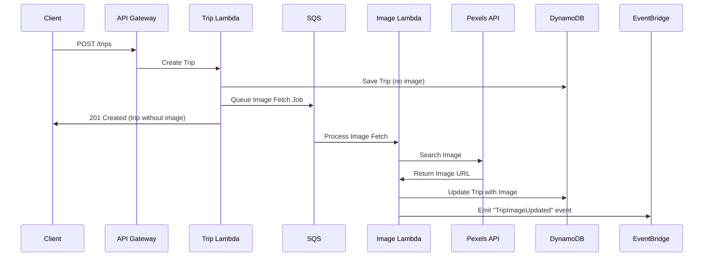

# AWS Serverless Migration: External Services Integration Guide

## Overview

This document analyzes how external service integrations in the NomadCrew backend would be adapted for AWS serverless architecture, using the Pexels API integration as a case study.

---

## Current External Service Integrations

### 1. **Pexels API (Image Service)**
- **Purpose**: Fetches destination images for trips
- **Current Implementation**: Simple HTTP client in Go
- **Configuration**: Environment variable `PEXELS_API_KEY`
- **Usage Pattern**: Synchronous API calls during trip creation

### 2. **Supabase Services**
- **Purpose**: Real-time features, authentication, storage
- **Current Implementation**: REST API client
- **Configuration**: `SUPABASE_URL`, `SUPABASE_KEY`
- **Usage Pattern**: Synchronous and asynchronous operations

### 3. **Weather Services** (Referenced in interfaces)
- **Purpose**: Weather data for destinations
- **Current Implementation**: Interface defined, implementation unclear
- **Usage Pattern**: Likely synchronous API calls

### 4. **Email Service (Resend)**
- **Purpose**: Transactional emails
- **Current Implementation**: REST API integration
- **Usage Pattern**: Event-driven, asynchronous

---

## AWS Serverless Adaptation Strategy

### 1. **Pexels API Migration to Lambda**

#### Current Implementation Analysis
```go
// Current monolithic approach
type TripHandler struct {
    pexelsClient *pexels.Client
}

func (h *TripHandler) fetchBackgroundImage(ctx context.Context, trip *types.Trip) string {
    searchQuery := pexels.BuildSearchQuery(trip)
    imageURL, err := h.pexelsClient.SearchDestinationImage(ctx, searchQuery)
    return imageURL
}
```

#### AWS Serverless Design

**Option A: Direct Lambda Integration**
```typescript
// lambda/functions/image-service/handler.ts
export const fetchDestinationImage = async (event: APIGatewayProxyEvent) => {
  const { destinationName, destinationAddress, tripName } = JSON.parse(event.body);
  
  // Build search query
  const searchQuery = destinationName || destinationAddress || tripName;
  
  // Call Pexels API
  const response = await fetch(`https://api.pexels.com/v1/search?query=${searchQuery}&per_page=1&orientation=landscape`, {
    headers: {
      'Authorization': process.env.PEXELS_API_KEY
    }
  });
  
  const data = await response.json();
  const imageUrl = data.photos?.[0]?.src?.landscape || '';
  
  return {
    statusCode: 200,
    body: JSON.stringify({ imageUrl })
  };
};
```

**Option B: Event-Driven Asynchronous Processing**
```yaml
# serverless.yml
functions:
  createTrip:
    handler: handlers/trip.create
    events:
      - http:
          path: /trips
          method: post
    environment:
      IMAGE_QUEUE_URL: ${self:custom.imageQueue.url}

  fetchTripImage:
    handler: handlers/image.fetch
    events:
      - sqs:
          arn: ${self:custom.imageQueue.arn}
    environment:
      PEXELS_API_KEY: ${env:PEXELS_API_KEY}
```

#### Architecture Decision: Asynchronous Image Fetching



### 2. **API Key Management in AWS**

#### Current Approach
```go
// Direct environment variable usage
pexelsClient := pexels.NewClient(cfg.ExternalServices.PexelsAPIKey)
```

#### AWS Best Practices

**Option 1: AWS Secrets Manager**
```typescript
import { SecretsManagerClient, GetSecretValueCommand } from "@aws-sdk/client-secrets-manager";

const secretsClient = new SecretsManagerClient({ region: process.env.AWS_REGION });

async function getPexelsApiKey(): Promise<string> {
  const command = new GetSecretValueCommand({
    SecretId: "nomadcrew/pexels/api-key"
  });
  
  const response = await secretsClient.send(command);
  return response.SecretString;
}
```

**Option 2: AWS Systems Manager Parameter Store**
```typescript
import { SSMClient, GetParameterCommand } from "@aws-sdk/client-ssm";

const ssmClient = new SSMClient({ region: process.env.AWS_REGION });

async function getPexelsApiKey(): Promise<string> {
  const command = new GetParameterCommand({
    Name: "/nomadcrew/pexels/api-key",
    WithDecryption: true
  });
  
  const response = await ssmClient.send(command);
  return response.Parameter.Value;
}
```

### 3. **Caching Strategy for External APIs**

#### Current State: No Caching
The current implementation makes a fresh API call for every trip creation.

#### AWS Serverless Caching Options

**Option 1: DynamoDB with TTL**
```typescript
// Cache Pexels responses in DynamoDB
const cacheTable = new Table(stack, 'PexelsCache', {
  partitionKey: { name: 'searchQuery', type: AttributeType.STRING },
  timeToLiveAttribute: 'ttl',
  billingMode: BillingMode.PAY_PER_REQUEST
});

// Lambda function
async function getCachedOrFetchImage(searchQuery: string) {
  // Check cache first
  const cached = await dynamoClient.get({
    TableName: 'PexelsCache',
    Key: { searchQuery }
  }).promise();
  
  if (cached.Item && cached.Item.ttl > Date.now() / 1000) {
    return cached.Item.imageUrl;
  }
  
  // Fetch from Pexels
  const imageUrl = await fetchFromPexels(searchQuery);
  
  // Cache for 7 days
  await dynamoClient.put({
    TableName: 'PexelsCache',
    Item: {
      searchQuery,
      imageUrl,
      ttl: Math.floor(Date.now() / 1000) + (7 * 24 * 60 * 60)
    }
  }).promise();
  
  return imageUrl;
}
```

**Option 2: ElastiCache Serverless**
```typescript
import { createClient } from 'redis';

const redis = createClient({
  url: process.env.REDIS_URL
});

async function getCachedOrFetchImage(searchQuery: string) {
  const cacheKey = `pexels:${searchQuery}`;
  
  // Check cache
  const cached = await redis.get(cacheKey);
  if (cached) {
    return JSON.parse(cached);
  }
  
  // Fetch from API
  const imageUrl = await fetchFromPexels(searchQuery);
  
  // Cache for 7 days
  await redis.setex(cacheKey, 7 * 24 * 60 * 60, JSON.stringify(imageUrl));
  
  return imageUrl;
}
```

### 4. **Rate Limiting and Retry Logic**

#### AWS Implementation
```typescript
// Using AWS SDK v3 with built-in retry
import { PexelsClient } from './pexels-client';
import { StandardRetryStrategy } from '@aws-sdk/middleware-retry';

const retryStrategy = new StandardRetryStrategy(async () => 3, {
  delayDecider: (delayBase, attempts) => delayBase * Math.pow(2, attempts),
  retryDecider: (error) => {
    if (error.statusCode === 429) { // Rate limit
      return true;
    }
    return error.statusCode >= 500;
  }
});

// Using SQS for rate limiting
const imageQueue = new Queue(stack, 'ImageFetchQueue', {
  visibilityTimeout: Duration.seconds(300),
  receiveMessageWaitTime: Duration.seconds(20),
  // Rate limit to 200 requests per hour (Pexels free tier)
  deliveryDelay: Duration.seconds(18) // 200 per hour = ~1 per 18 seconds
});
```

### 5. **Error Handling and Fallbacks**

#### Current Implementation
```go
// Simple error logging, returns empty string
if err != nil {
    log.Warnw("Failed to fetch background image from Pexels", "error", err)
    return ""
}
```

#### AWS Serverless Approach
```typescript
// Lambda with DLQ and fallback logic
export const fetchImageHandler = async (event: SQSEvent) => {
  for (const record of event.Records) {
    const { tripId, searchQuery, attemptNumber = 1 } = JSON.parse(record.body);
    
    try {
      const imageUrl = await fetchFromPexels(searchQuery);
      await updateTripImage(tripId, imageUrl);
    } catch (error) {
      if (attemptNumber < 3) {
        // Retry with exponential backoff
        await sqs.sendMessage({
          QueueUrl: process.env.IMAGE_QUEUE_URL,
          MessageBody: JSON.stringify({
            tripId,
            searchQuery,
            attemptNumber: attemptNumber + 1
          }),
          DelaySeconds: Math.pow(2, attemptNumber) * 60
        }).promise();
      } else {
        // Final failure - use fallback
        await updateTripImage(tripId, process.env.DEFAULT_TRIP_IMAGE_URL);
        
        // Send to DLQ for manual review
        await sqs.sendMessage({
          QueueUrl: process.env.IMAGE_DLQ_URL,
          MessageBody: JSON.stringify({
            tripId,
            searchQuery,
            error: error.message,
            timestamp: new Date().toISOString()
          })
        }).promise();
      }
    }
  }
};
```

### 6. **Monitoring and Observability**

#### CloudWatch Metrics
```typescript
// Custom metrics for external API calls
import { CloudWatchClient, PutMetricDataCommand } from "@aws-sdk/client-cloudwatch";

const cloudwatch = new CloudWatchClient({ region: process.env.AWS_REGION });

async function trackApiCall(service: string, success: boolean, latency: number) {
  await cloudwatch.send(new PutMetricDataCommand({
    Namespace: 'NomadCrew/ExternalAPIs',
    MetricData: [{
      MetricName: 'APICallLatency',
      Value: latency,
      Unit: 'Milliseconds',
      Dimensions: [
        { Name: 'Service', Value: service },
        { Name: 'Status', Value: success ? 'Success' : 'Failure' }
      ]
    }]
  }));
}
```

#### X-Ray Tracing
```typescript
import { captureHTTPsGlobal } from 'aws-xray-sdk-core';
import https from 'https';

// Automatically trace all HTTPS calls
captureHTTPsGlobal(https);

// Manual subsegment for business logic
import { getSegment } from 'aws-xray-sdk-core';

export const handler = async (event) => {
  const segment = getSegment();
  const subsegment = segment.addNewSubsegment('PexelsAPI');
  
  try {
    subsegment.addAnnotation('searchQuery', event.searchQuery);
    const result = await fetchFromPexels(event.searchQuery);
    subsegment.addMetadata('response', { imageUrl: result });
    return result;
  } catch (error) {
    subsegment.addError(error);
    throw error;
  } finally {
    subsegment.close();
  }
};
```

---

## Migration Recommendations

### 1. **Phased Approach**
- **Phase 1**: Migrate to Lambda with synchronous calls (minimal changes)
- **Phase 2**: Implement caching layer
- **Phase 3**: Move to asynchronous processing with SQS
- **Phase 4**: Add advanced features (retry, circuit breaker, fallbacks)

### 2. **Cost Optimization**
- Cache external API responses aggressively
- Use SQS batch processing to reduce Lambda invocations
- Implement request deduplication for identical queries

### 3. **Performance Optimization**
- Pre-warm Lambda functions for critical paths
- Use Lambda layers for shared dependencies
- Implement connection pooling for HTTP clients

### 4. **Reliability Improvements**
- Implement circuit breakers for external services
- Use dead letter queues for failed requests
- Set up CloudWatch alarms for API failures

---

## Implementation Template

```typescript
// External service Lambda template
import { APIGatewayProxyHandler } from 'aws-lambda';
import { SecretsManagerClient } from '@aws-sdk/client-secrets-manager';
import { DynamoDBClient } from '@aws-sdk/client-dynamodb';
import { CloudWatchClient } from '@aws-sdk/client-cloudwatch';
import middy from '@middy/core';
import secretsManager from '@middy/secrets-manager';
import httpErrorHandler from '@middy/http-error-handler';
import xray from 'aws-xray-sdk-core';

const dynamodb = xray.captureAWSClient(new DynamoDBClient({}));
const cloudwatch = xray.captureAWSClient(new CloudWatchClient({}));

const baseHandler: APIGatewayProxyHandler = async (event, context) => {
  const { searchQuery } = JSON.parse(event.body);
  
  // Check cache
  const cached = await checkCache(searchQuery);
  if (cached) {
    await trackMetric('CacheHit', 1);
    return {
      statusCode: 200,
      body: JSON.stringify({ imageUrl: cached })
    };
  }
  
  // Call external API
  const startTime = Date.now();
  try {
    const imageUrl = await callExternalApi(searchQuery, context.PEXELS_API_KEY);
    await saveToCache(searchQuery, imageUrl);
    await trackMetric('APICallSuccess', 1, Date.now() - startTime);
    
    return {
      statusCode: 200,
      body: JSON.stringify({ imageUrl })
    };
  } catch (error) {
    await trackMetric('APICallFailure', 1);
    throw error;
  }
};

export const handler = middy(baseHandler)
  .use(secretsManager({
    fetchData: {
      PEXELS_API_KEY: '/nomadcrew/pexels/api-key'
    }
  }))
  .use(httpErrorHandler());
```

This comprehensive guide provides a roadmap for migrating external service integrations to AWS serverless architecture while maintaining reliability, performance, and cost-effectiveness.