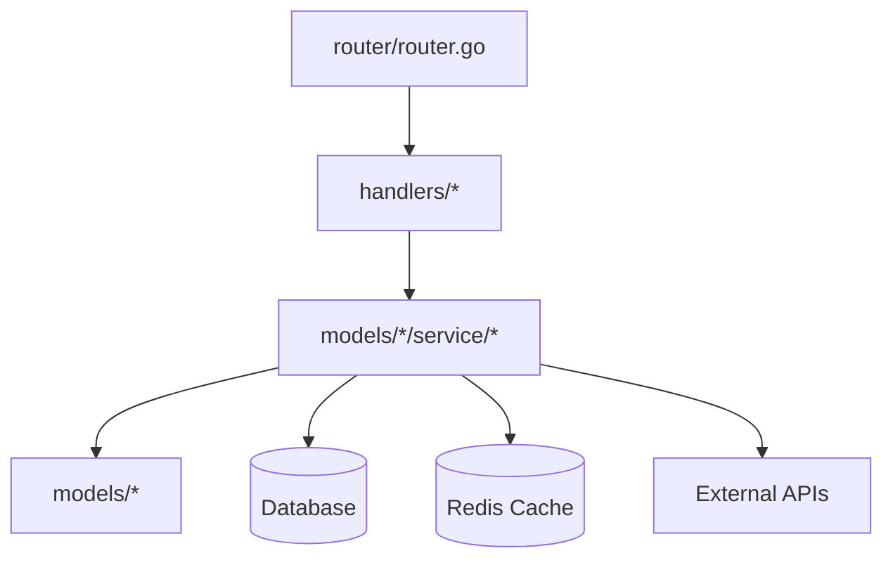

# System Architecture & Patterns

## Directory Structure

```
nomad-crew-backend/
├── handlers/           # HTTP request handlers
├── models/            # Domain models and services
│   ├── <domain>/     # Domain-specific packages
│   │   ├── service/  # Service implementations
│   │   └── types.go  # Domain types
├── router/           # Route definitions
├── middleware/       # HTTP middleware
└── utils/           # Shared utilities
```

## Key Technical Decisions

1. **Service Layer Pattern:**
   - Services live in `models/<domain>/service/`
   - Each domain has its own package
   - Services implement interfaces defined in `service/interfaces.go`
   - Internal permission checks within service methods
   - Example: `models/location/service/location_service.go`

2. **Routing:**
   - Centralized in `router/router.go`
   - Routes grouped by domain/feature
   - Middleware applied at group level where appropriate

3. **Weather Service:**
   - Uses Open-Meteo API for weather data
   - Nominatim for geocoding fallback
   - Structured response types in `types/weather.go`
   - Caching strategy for API responses

4. **Location Service:**
   - Offline location data handling
   - Permission-based access control
   - Comprehensive test coverage
   - Clear separation between interface and implementation

## Design Patterns

1. **Dependency Injection:**
   - Services receive dependencies through constructors
   - Interfaces defined separately from implementations
   - Example: `OfflineLocationServiceInterface`

2. **Repository Pattern:**
   - Database operations abstracted behind interfaces
   - Clear separation of data access from business logic

3. **Middleware Chain:**
   - Authentication
   - Logging
   - Error handling
   - Request validation

4. **Service Layer:**
   - Business logic encapsulation
   - Permission checks
   - Error handling
   - Type validation

## Component Relationships



## Error Handling

1. **Service Layer:**
   - Domain-specific errors
   - Permission errors
   - Validation errors

2. **HTTP Layer:**
   - Status code mapping
   - Error response structure
   - Logging

## Testing Strategy

1. **Unit Tests:**
   - Service layer focus
   - Mock external dependencies
   - Example: `location_service_test.go`

2. **Integration Tests:**
   - API endpoint testing
   - Database interactions
   - External service mocking

*This file documents system architecture and key technical decisions.* 